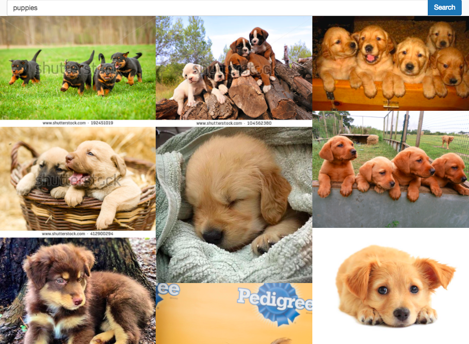

# Image Inspiration
A small simple image search engine UI

<a href="https://github.com/nperez0111/ImageInspiration">  </a>
## What is it?
This is a simple search engine UI that I created. It uses Google Images API to retrieve results and display them in a nice masonry layout.The UI is completely decoupled from the back-end and is capable of having adaptors written to use other back-ends such as the Yahoo Image Search API.

## The Nitty Gritty
This program works mostly within the script folder because it is using ractive.js to template out each view. This uses a bunch of utility files within [this folder](https://github.com/nperez0111/ImageInspiration/tree/master/app/scripts/ractives) which are all seperated into the specific categories denoted by file name. These all form the base class which [(Main.js)](https://github.com/nperez0111/ImageInspiration/blob/master/app/scripts/app.js) extends further with UI Implementation details, so as to mix concerns with connection to DataBase searching. This is the created an instance of [(within app.js)](https://github.com/nperez0111/ImageInspiration/blob/master/app/scripts/app.js) where it is plugged into the Router.

### How to connect another database
All that you have to do is go to [here](https://github.com/nperez0111/ImageInspiration/tree/master/app/scripts/ractives). From inside of there you can use [GoogleSearch.js](https://github.com/nperez0111/ImageInspiration/blob/master/app/scripts/ractives/GoogleSearch.js) as a guide of the format that the program is expecting. Then from there you extend the instance [(within app.js)](https://github.com/nperez0111/ImageInspiration/blob/master/app/scripts/app.js) like so: 
````JS
const YourImageDataBaseImplmentation = Main.extend({/*all the stuff for the other image database*/})
````
